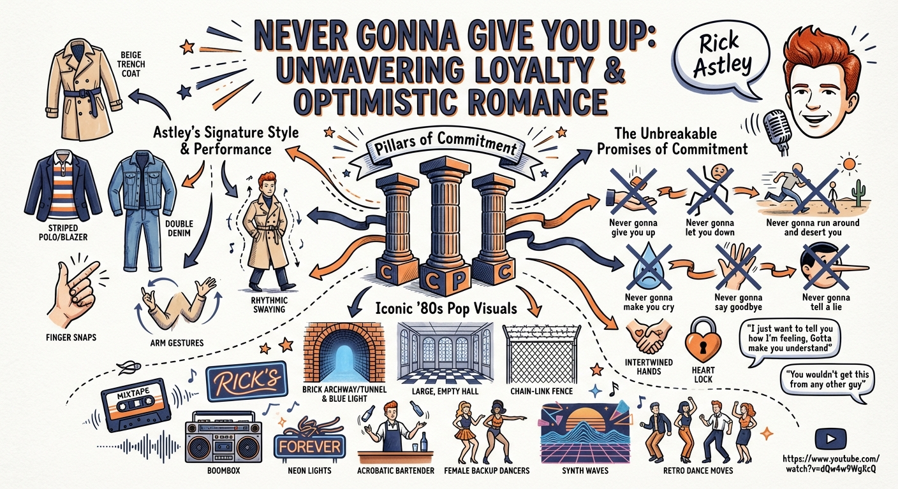

# Sketchnote Artist Agent

The **Sketchnote Artist Agent** is an intelligent CLI application that turns YouTube videos into beautiful, hand-drawn style visual summaries (sketchnotes). 

Built with Go and the [Google Go Agent Development Kit (ADK)](https://github.com/google/adk-go), it demonstrates the power of sequential multi-agent workflows.

## 🚀 How It Works

The application employs a chain of two specialized AI agents:

1.  **The Summarizer Agent**:
    *   **Role**: Content Strategist.
    *   **Task**: Watches the YouTube video, analyzes the content, and synthesizes a structured "Visual Brief" containing the core thesis, main takeaways, and memorable quotes.
    *   **Model**: Gemini 3.0 Pro.

2.  **The Artist Agent**:
    *   **Role**: Master Sketchnote Artist.
    *   **Task**: Interprets the Visual Brief and orchestrates the generation of a high-quality image that mimics alcohol markers and ink on paper.
    *   **Model**: Gemini 2.5 Flash (for reasoning), leveraging the `generate_image` tool which uses Gemini 3.0 Pro Image (Imagen 3).

## 🛠️ Prerequisites

*   [Go](https://go.dev/dl/) (version 1.25.3 or later)
*   A Google Cloud Project with the **Gemini API** enabled.
*   A valid **Google Cloud API Key**.

## 📦 Installation & Setup

1.  **Clone the repository:**
    ```bash
    git clone https://github.com/danielvaughan/sketchnote-artist.git
    cd sketchnote-artist
    ```

2.  **Configure Environment Variables:**
    Create a `.env` file in the root directory:
    ```bash
    touch .env
    ```
    Add your API key to the file:
    ```env
    GOOGLE_API_KEY=your_google_api_key_here
    ```

3.  **Install Dependencies:**
    ```bash
    go mod download
    ```

## 🎨 Usage

Run the agent directly using `go run` pointing to the main package:

```bash
go run ./cmd/sketchnote console
```

Enter just the video URL at the User prompt:

```bash
User -> https://www.youtube.com/watch?v=dQw4w9WgXcQ
```

The agent will:
1.  Process the video.
2.  Print the progress of the agents.
3.  Save the resulting image as `<Title>.png` in the current directory.

## 🖼️ Example Output



## 🌐 REST API Usage

The application also includes a REST API server.

### Starting the Server

```bash
go run cmd/server/main.go
```

The server listens on port `8080` by default.

### Consuming the API

You can interact with the agent using standard HTTP requests.

1.  **List Available Apps**:
    ```bash
    curl http://localhost:8080/list-apps
    # Output: ["sketchnote-artist"]
    ```

2.  **Create a Session**:
    ```bash
    curl -X POST http://localhost:8080/apps/sketchnote-artist/users/test-user/sessions
    ```
    Copy the `id` from the JSON response.

3.  **Run the Agent**:
    Replace `<session-id>` with the ID from the previous step.
    ```bash
    curl -X POST -H "Content-Type: application/json" -d '{
      "appName": "sketchnote-artist",
      "userId": "test-user",
      "sessionId": "<session-id>",
      "newMessage": {
        "role": "user",
        "parts": [
          { "text": "https://www.youtube.com/watch?v=dQw4w9WgXcQ" }
        ]
      }
    }' http://localhost:8080/run
    ```

## 🏗️ Architecture

The project follows a standard Go layout:

*   **`cmd/sketchnote/main.go`**: The main entry point. Initializes the Gemini models, tools, and constructs the `SequentialAgent` workflow.
*   **`internal/agents/`**: Contains the definitions for the Summarizer and Artist agents.
*   **`internal/tools/`**: Custom tools for YouTube summarization (`youtube_summarizer.go`), image generation (`generate_image_tool.go`), and file saving (`save_to_file_tool.go`).
*   **`internal/flows/`**: Defines the sequential workflow logic.
*   **`internal/prompts/`**: Contains the system instructions that define the personas.

## 🧪 Running Tests

To run unit tests (skipping slow integration tests):
```bash
go test ./...
```

To run all tests including integration tests (requires API key):
```bash
go test -tags=integration ./...
```

## 📄 License

[MIT License](LICENSE)
