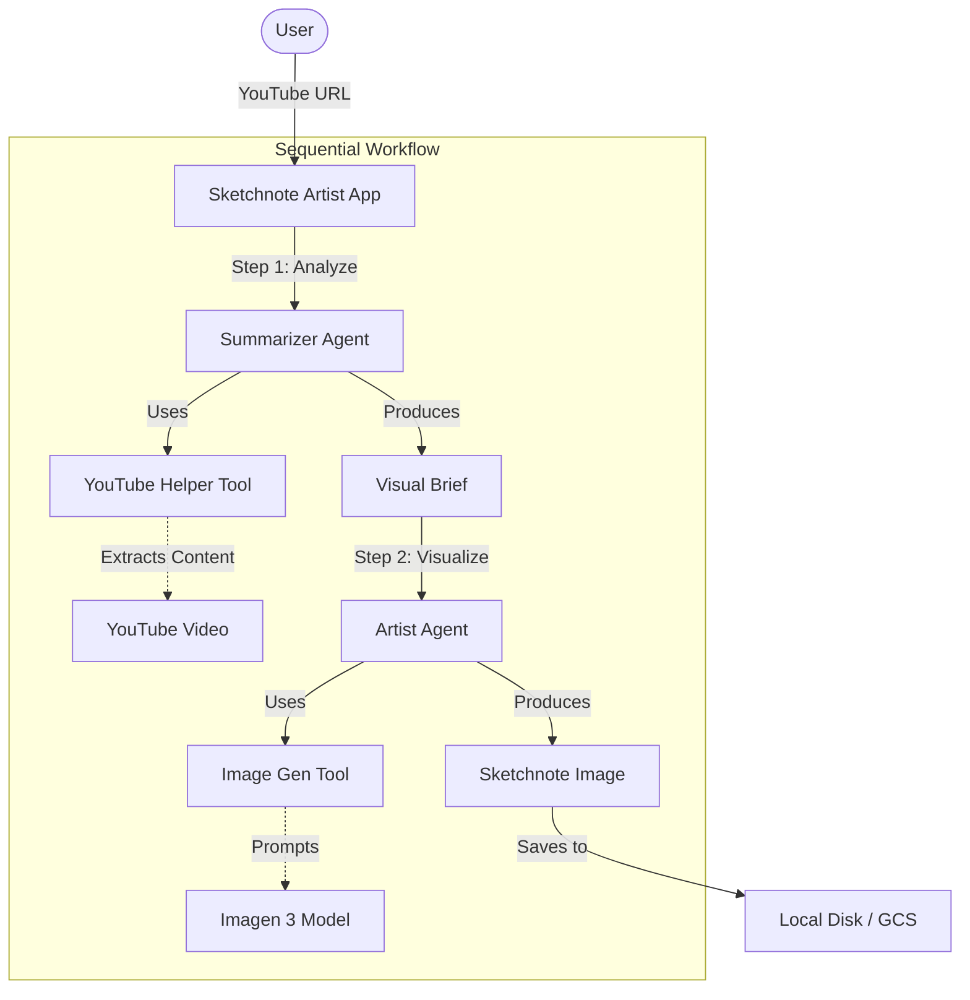

# Sketchnote Artist Agent

[Cloud Build Status](https://console.cloud.google.com/cloud-build/triggers?project=sketchnote-artist-application)

## What Is This?

Ever wished you could turn YouTube videos into beautiful, hand-drawn visual summaries that actually help you remember what you watched? That's exactly what **Sketchnote Artist** does.

This intelligent application transforms video content into sketchnotes—visual summaries that capture the essence of what matters most. Built with Go and the [Google Go Agent Development Kit (ADK)](https://github.com/google/adk-go), it's a demonstration of how sequential multi-agent workflows can solve real problems in how we consume and retain knowledge.

## 🚀 Under the Hood: The Sequential Agent Workflow

This isn't just a wrapper around an API call—it's a carefully orchestrated dance between two specialized AI agents, each with distinct expertise:

1. **The Summarizer (Content Strategist)**:
    * **Brain**: Gemini 3 Flash—chosen for its massive context window and incredible speed.
    * **What it does**: "Watches" your YouTube video, ingests the entire transcript, and synthesizes a structured "Visual Brief" containing the core thesis, key takeaways, and memorable quotes. Think of it as the curator that decides what matters most.

2. **The Artist (Master Illustrator)**:
    * **Brain**: Gemini 3 Flash for reasoning, wielding the `generate_image` tool powered by Imagen 3.
    * **What it does**: Takes the Visual Brief and transforms it into a high-quality image that genuinely looks like it was drawn with alcohol markers and ink on paper. The quality leap with Imagen 3 is remarkable—it handles text rendering and stylistic nuances with impressive fidelity.

## 🏗️ How the Pieces Fit Together

Here's the complete workflow visualized:



### Code Organization

The project follows a clean, standard Go layout that makes it easy to navigate:

* **`cmd/sketchnote/main.go`**: The main entry point. Initializes the Gemini models, tools, and constructs the `SequentialAgent` workflow.
* **`internal/agents/`**: Contains the definitions for the Summarizer and Artist agents.
* **`internal/tools/`**: Custom tools for YouTube summarization (`youtube_summarizer.go`), image generation (`generate_image_tool.go`), and file saving (`save_to_file_tool.go`).
* **`internal/flows/`**: Defines the sequential workflow logic.
* **`internal/prompts/`**: Contains the system instructions that define the personas.

## 🛠️ What You'll Need

Before you get started, make sure you have:

* **[Go](https://go.dev/dl/)** (version 1.25.3 or later) installed
* **A Google Cloud Project** with the Gemini API enabled
* **A Google Cloud API Key**—grab one from [Google AI Studio](https://aistudio.google.com/):
    1. Head to [Google AI Studio](https://aistudio.google.com/)
    2. Click **Get API key** in the left sidebar
    3. Click **Create API key** (use an existing project or create a new one)
    4. Copy the generated key—you'll need it in a moment

## 📦 Getting Started

Ready to generate your first sketchnote? Here's how to get up and running:

1. **Clone the repository:**

    ```bash
    git clone https://github.com/danielvaughan/sketchnote-artist.git
    cd sketchnote-artist
    ```

2. **Add your API key:**

    Create a `.env` file in the root directory:

    ```bash
    touch .env
    ```

    Drop your API key into the file:

    ```env
    GOOGLE_API_KEY=your_google_api_key_here
    ```

3. **Install dependencies:**

    ```bash
    go mod download
    ```

## 🎨 Running Sketchnote Artist

One of the real strengths of the Go ADK is its versatility—you can run Sketchnote Artist however you prefer.

### CLI Mode: For Terminal Enthusiasts

Perfect if you live in the terminal. Just fire it up and watch the agents work their magic:

```bash
go run ./cmd/sketchnote console
```

When prompted, paste in a YouTube URL:

```bash
User -> https://www.youtube.com/watch?v=dQw4w9WgXcQ
```

Behind the scenes, the Summarizer processes the video, extracts the essential insights, and hands off the Visual Brief to the Artist. The Artist then "draws" the final output, turning abstract concepts into concrete visuals.

Your sketchnote gets saved as `generated_result_<timestamp>.png` (or named after the video title) right in your current directory.

### Web Mode: For a Friendlier Experience

The project also includes a REST API server with a clean web interface—perfect for anyone who prefers clicking to typing.

#### Fire up the server

```bash
go run cmd/server/main.go
```

The server starts listening on port `8080`.

#### Using the API

1. **See what's available:**

    ```bash
    curl http://localhost:8080/list-apps
    # Output: ["sketchnote-artist"]
    ```

2. **Start a session:**

    ```bash
    curl -X POST http://localhost:8080/apps/sketchnote-artist/users/test-user/sessions
    ```

    Grab the `id` from the JSON response.

3. **Generate a sketchnote:**

    Replace `<session-id>` with the ID from step 2:

    ```bash
    curl -X POST -H "Content-Type: application/json" -d '{
      "appName": "sketchnote-artist",
      "userId": "test-user",
      "sessionId": "<session-id>",
      "newMessage": {
        "role": "user",
        "parts": [
          { "text": "https://www.youtube.com/watch?v=dQw4w9WgXcQ" }
        ]
      }
    }' http://localhost:8080/run
    ```

## 🧪 Testing

### Unit Tests

Want to verify everything's working? Run the fast unit tests:

```bash
go test ./...
```

Need the full suite including integration tests? (You'll need your API key set up):

```bash
go test -tags=integration ./...
```

### End-to-End (E2E) Tests

The project includes automated end-to-end tests that verify the complete workflow against the deployed environment.

1. **Set up the test environment:**

    ```bash
    npm install
    npx playwright install --with-deps
    ```

2. **Point to your service:**

    For local testing:

    ```bash
    export SERVICE_URL=http://localhost:8080
    ```

    For testing the deployed environment:

    ```bash
    export SERVICE_URL=$(cd terraform && terraform output -raw service_url)
    ```

3. **Run the tests:**

    Test the web interface:

    ```bash
    npx playwright test e2e/webui.spec.ts
    ```

    Test the API directly:

    ```bash
    npx playwright test e2e/api.spec.ts
    ```

    Or run everything at once:

    ```bash
    npx playwright test
    ```

## ☁️ Deploying to Google Cloud Run

Want to host Sketchnote Artist so anyone can use it? The entire infrastructure is managed via Terraform, making deployment straightforward.

### What You'll Need

Before deploying, get these tools set up:

1. [Install Terraform](https://developer.hashicorp.com/terraform/install)
2. [Install Google Cloud SDK](https://cloud.google.com/sdk/docs/install)
3. Authenticate with your Google Cloud account:

    ```bash
    gcloud auth login
    gcloud auth application-default login
    ```

### Deploying Your Infrastructure

1. **Jump into the terraform directory:**

    ```bash
    cd terraform
    ```

2. **Initialize Terraform:**

    ```bash
    terraform init
    ```

3. **Configure your deployment:**

    Start with the template:

    ```bash
    cp terraform.tfvars.template terraform.tfvars
    ```

    Open `terraform.tfvars` and customize these values:
    * `project_id`: Your Google Cloud Project ID
    * `domain`: Your custom domain (e.g., `app.example.com`)
    * `allowed_user_emails`: Who gets access through Identity-Aware Proxy
    * `iap_client_id` & `iap_client_secret`: Get these from GCP Console → APIs & Services → Credentials → OAuth 2.0 Client IDs
    * `google_api_key`: Your Gemini API Key

4. **Deploy everything:**

    ```bash
    terraform apply
    ```

    Review the plan and type `yes` to confirm.

5. **Finish the setup:**
    * Point your domain's DNS A record to the `load_balancer_ip` from Terraform's output
    * Add the OAuth callback URL in GCP Console: `https://iap.googleapis.com/v1/oauth/clientIds/YOUR_CLIENT_ID:handleRedirect`

## 🖼️ See It in Action

Instead of a wall of text or fragmented notes, you get clean, visual artifacts like this:


## 🚀 Give It a Try

Whether you want to generate sketchnotes for your own learning or dive into the code to see how a multi-agent system is structured in Go, this project is ready for you. Clone it, run it locally, and let AI sketch your next learning session.

Questions? Issues? Contributions? Head over to the [GitHub repository](https://github.com/danielvaughan/sketchnote-artist) and get involved!

## 📄 License

[MIT License](LICENSE)
