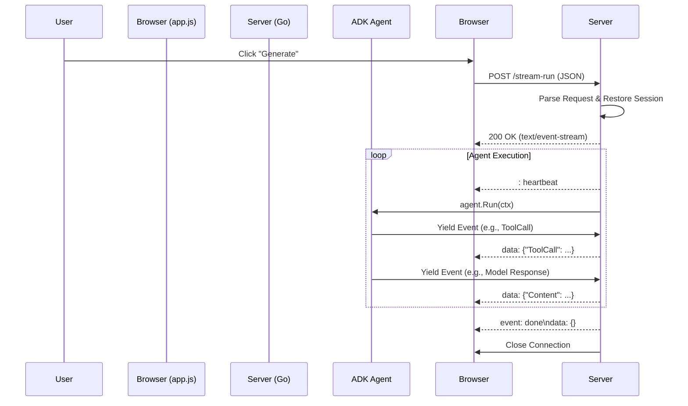

# HTTP Server-Sent Events (SSE) in ADK

## 1. Overview: The Need for Streaming

Generative AI agents often perform **Long-Running Operations (LROs)**. A single user request (e.g., "Research this topic") might trigger a sequence of steps taking 30 seconds to several minutes.

### The Problem with Standard REST
*   **Timeouts**: Load balancers (e.g., Google Cloud Load Balancer) and serverless platforms (Cloud Run) often have idle timeouts (typically 60-300 seconds). If the server is "thinking" and sends no data, the connection is dropped.
*   **Poor UX**: Users stare at a spinner for minutes without knowing if the application is broken or working.
*   **ADK Default**: The default `adkrest` handler buffers the entire agent execution and returns a single JSON response. This works for quick chats but fails for complex, multi-step workflows.

### The Solution: Server-Sent Events (SSE)
SSE is a standard HTTP protocol (`Content-Type: text/event-stream`) allowing servers to push data to clients over a single, long-lived HTTP connection.

*   **Heartbeats**: We can send "keep-alive" comments (e.g., `: heartbeat`) to prevent infrastructure timeouts.
*   **Real-time Feedback**: We can stream intermediate "thoughts" (tool calls, status updates) to the UI.

## 2. Architecture



## 3. Backend Implementation (Go)

To implement this with the ADK, we bypass the standard `adkrest` handler for specific endpoints.

### 3.1. The Custom Handler
Located in `cmd/server/main.go`. It sets the correct headers and casts the `http.ResponseWriter` to a `http.Flusher`.

```go
// 1. Set Headers
w.Header().Set("Content-Type", "text/event-stream")
w.Header().Set("Cache-Control", "no-cache")
w.Header().Set("Connection", "keep-alive")

// 2. Flush Headers immediately
if flusher, ok := w.(http.Flusher); ok {
    flusher.Flush()
}

// 3. Send Heartbeat (Comment line starting with colon)
fmt.Fprintf(w, ": heartbeat\n\n")
flusher.Flush()
```

### 3.2. Implementing `InvocationContext`
The ADK `agent.Run` method requires an `InvocationContext`. Since we are running outside the standard launcher flow, we must implement a minimal context.

**Critical**: You **must** populate the `Session()` method with a real session object if your agents rely on state (e.g., retrieving artifacts from previous steps).

```go
// SimpleInvocationContext implements agent.InvocationContext for streaming
type SimpleInvocationContext struct {
    context.Context
    sessionID   string
    session     session.Session // <--- Crucial field
    userContent *genai.Content
}

// Implement the interface methods
func (s *SimpleInvocationContext) Session() session.Session    { return s.session }
func (s *SimpleInvocationContext) UserContent() *genai.Content { return s.userContent }
func (s *SimpleInvocationContext) InvocationID() string        { return "stream-" + s.sessionID }
func (s *SimpleInvocationContext) RunConfig() *agent.RunConfig { return nil }
func (s *SimpleInvocationContext) Memory() agent.Memory        { return nil }
func (s *SimpleInvocationContext) Artifacts() agent.Artifacts  { return nil }
func (s *SimpleInvocationContext) EndInvocation()              {}
func (s *SimpleInvocationContext) Ended() bool                 { return false }
func (s *SimpleInvocationContext) Agent() agent.Agent          { return nil }
func (s *SimpleInvocationContext) Branch() string              { return "" }
```

### 3.3. Running the Agent (The Loop)
Use `agent.Run(ctx)` which returns a Go iterator (`iter.Seq2`). This allows you to stream events one by one.

```go
// 1. Retrieve the Session State
// You need access to your 'sessionService' (e.g., session.InMemoryService())
resp, err := sessionSvc.Get(r.Context(), &session.GetRequest{
    AppName:   "my-app",
    UserID:    "user-123",
    SessionID: req.SessionID,
})
if err != nil {
    // Handle error (session not found)
    return
}

// 2. Create Context
invCtx := &SimpleInvocationContext{
    Context:     r.Context(),
    sessionID:   req.SessionID,
    session:     resp.Session, // Pass the retrieved session
    userContent: &genai.Content{Parts: []*genai.Part{{Text: "User Input"}}},
}

// 3. Iterate over ADK events
for event, err := range agentInstance.Run(invCtx) {
    if err != nil {
        // Send error event to client
        fmt.Fprintf(w, "event: error\ndata: {\"error\": \"%s\"}\n\n", err.Error())
        flusher.Flush()
        return
    }

    // Serialize event to JSON
    data, _ := json.Marshal(event)
    
    // Write SSE formatted message (data: <json>\n\n)
    fmt.Fprintf(w, "data: %s\n\n", data)
    flusher.Flush()
}

// 4. Send Done Event
fmt.Fprintf(w, "event: done\ndata: {}\n\n")
flusher.Flush()
```

## 4. Frontend Implementation (Vanilla JS)

Modern browsers support `EventSource`, but it doesn't support `POST` requests. Instead, we use `fetch` with a `ReadableStream`.

### 4.1. Reading the Stream
Located in `web/app.js`.

```javascript
const response = await fetch('/stream-run', {
    method: 'POST',
    body: JSON.stringify({ ... })
});

const reader = response.body.getReader();
const decoder = new TextDecoder();

while (true) {
    // read() allows us to process chunks as they arrive
    const { done, value } = await reader.read();
    if (done) break;
    
    const chunk = decoder.decode(value, { stream: true });
    // Process chunk (handle split lines, parse "data: " lines)
}
```

### 4.2. Handling Events
We map raw ADK events to UI states:

*   **`event.Recall` / `event.Models`**: The LLM is "Thinking" or generating text. -> *Show "Curator is analyzing..."*
*   **`event.ToolCall`**: The agent is performing an action.
    *   `Name: "summarize_..."` -> *Show "Summarizing video..."*
    *   `Name: "generate_image"` -> *Show "Artist is sketching..."*
*   **`event.Content`**: The final response (usually contains the text result).

## 5. Gotchas & Best Practices

1.  **Session Parsers**: When manually running the agent, you must manually retrieve the `session.Session` object (using `session.GetRequest`) and pass it to your context. If you pass `nil`, the agent might panic or fail to access state (e.g., reading a visual brief saved in a previous step).
    
    *Bad:*
    ```go
    // SimpleInvocationContext.Session returns nil
    func (s *Ctx) Session() session.Session { return nil } 
    ```
    
    *Good:*
    ```go
    // Fetch and store the actual session
    resp, _ := sessionService.Get(...)
    invCtx := &Ctx{session: resp.Session}
    ```

2.  **Infrastructure Buffering**:
    *   **Cloud Run / Nginx**: Some proxies buffer responses by default. Disable this with the `X-Accel-Buffering: no` header.
    *   **HTTP/2**: Cloud Run uses HTTP/2 by default, which can cause response buffering. Ensure your server sends `200 OK` (not `201`) and flushes headers immediately.
    *   **Gzip**: Compression middlewares might buffer the entire response to compress it. Disable compression for SSE endpoints.

3.  **Timeouts (Crucial for GenAI)**:
    *   **Cloud Run Request Timeout**: Default is 5 minutes (300s). Can be increased to 60 mins. If your agent runs longer than this, the connection will be hard-closed by Google.
    *   **Idle Timeout**: Load balancers often have a 30s-60s idle timeout. If the LLM is "thinking" for > 60s without output, the connection drops. **Solution**: Use Heartbeats (sent every 15-30s).

4.  **Browser Connection Limits**:
    *   **HTTP/1.1**: Browsers allow only ~6 concurrent connections per domain. If a user opens 7 tabs of your app, the 7th will hang.
    *   **HTTP/2**: Supports multiplexing (100+ streams), effectively solving this. Cloud Run supports HTTP/2 automatically, so this is rarely an issue in production but can affect local development if using HTTP/1.1.

5.  **Client Implementation: `fetch` vs `EventSource`**:
    *   **`EventSource` (Native)**: Easiest API, auto-reconnects. *Limitation*: Only supports `GET`, cannot set custom headers (like Auth tokens).
    *   **`fetch` (Recommended)**: Supports `POST`, custom headers, and `AbortController`. *Tradeoff*: You must manually parse the stream (as shown above) and implement your own retry logic if needed.

6.  **JSON Splitting**: TCP packets don't respect newline boundaries. A chunk might end in the middle of a JSON string. Your frontend parser MUST handle incomplete lines (buffer them until a `\n\n` is found).
